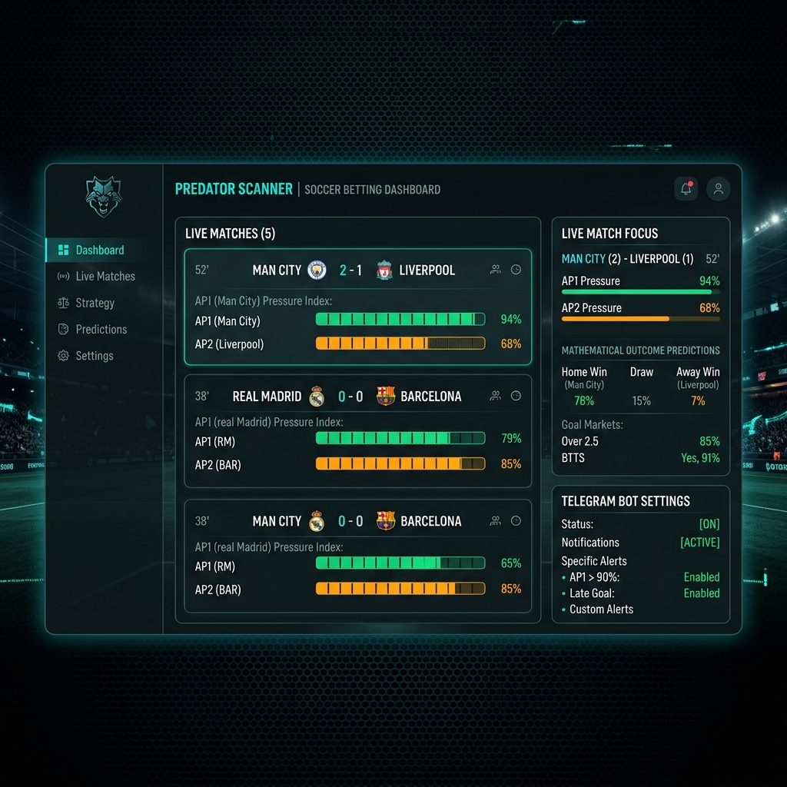

# Predator Scanner Web Pro 🚀

O **Predator Scanner Web Pro** é uma plataforma de análise estatística em tempo real para futebol, projetada para identificar oportunidades de valor em mercados de gols, escanteios e cartões. O sistema combina raspagem de dados dinâmica (Selenium), projeções matemáticas calibradas (modelo Poisson/Decaimento) e alertas automatizados via Telegram.



---

## ⚡ Funcionalidades Principais

*   **Grade de Jogos ao Vivo (Live Grid):** Monitoramento em tempo real de todas as partidas em andamento coletadas diretamente da página do Sofascore.
*   **Índices de Pressão AP1 e AP2:** 
    *   *AP1 (Attack Pressure 1):* Mede a intensidade de domínio ofensivo dos últimos 10 minutos (0 a 100%).
    *   *AP2 (Attack Pressure 2):* Foca na pressão de abafamento e finalizações dos últimos 5 minutos (0 a 100%).
*   **Projeções de Valor (Previsões):** Cálculo automatizado de probabilidades e "Odd Justa" para mercados como:
    *   Mais Gols na Partida (Over Gols)
    *   Total de Escanteios (Over Cantos)
    *   Escanteios nos próximos 10 minutos
    *   Total de Cartões
*   **Integração com Telegram Bot:** Envio instantâneo de sinais de apostas estruturados diretamente no seu canal ou chat privado quando o modelo calcula uma confiança acima da média configurada.
*   **Definição Manual de Minutos:** Simulação de cenários dinâmicos alterando o tempo do jogo manualmente para recalcular as odds e probabilidades futuras.

---

## 🛠️ Tecnologias Utilizadas

### Backend
*   **Python 3.10+** com **FastAPI** para a construção de endpoints de alta performance.
*   **Selenium & WebDriver Manager** para automação e extração de dados dinâmicos da home e das partidas do Sofascore.
*   **Uvicorn** como servidor ASGI.

### Frontend
*   **Vite + React.js** para uma SPA (Single Page Application) rápida e responsiva.
*   **Lucide React** para ícones modernos.
*   **CSS Puro** com tema futurista escuro (*Dark Mode*).

---

## 🚀 Como Executar o Projeto

### 1. Requisitos Prévios
*   Ter o Python instalado em sua máquina.
*   Ter o Node.js instalado em sua máquina.
*   Google Chrome instalado (utilizado pelo driver do Selenium headless).

### 2. Backend (FastAPI)
Abra o terminal na pasta raiz do projeto e execute:
```bash
# Instalar dependências necessárias
pip install fastapi uvicorn pydantic requests selenium webdriver-manager

# Executar o servidor de desenvolvimento
python app.py
```
A API estará rodando em `http://127.0.0.1:8000`.

### 3. Frontend (React)
Abra outro terminal na pasta `frontend/` e execute:
```bash
# Instalar dependências do Node
npm install

# Iniciar o servidor local de desenvolvimento
npm run dev
```
A aplicação web estará acessível em `http://localhost:5173`.

---

## 🤖 Configurando o Robô do Telegram
1. Clique no botão de chave (**🔑 Configurações**) no topo do painel do site.
2. Ative a caixa **"Ativar Robô de Sinais Automatizados"**.
3. Insira o **Token do seu Bot** (gerado pelo `@BotFather` no Telegram) e o **Chat ID** do seu grupo/canal.
4. Defina a confiança mínima desejada (ex: 70%).
5. Clique em **Salvar** e use o botão **Enviar Teste** para confirmar que as mensagens estão chegando.

---

## 📂 Estrutura do Repositório

```text
├── app.py                  # API Backend em FastAPI com scraper e lógica preditiva
├── chaves_api.txt          # Gerenciamento local das RapidAPI Keys
├── historico_jogos.json    # Histórico de partidas salvas
├── telegram_config.json    # Configurações do robô de alertas
├── screenshots/            # Pasta de capturas e mockups de tela
│   └── predator_dashboard.png
└── frontend/               # Código-fonte da aplicação React
    ├── src/
    │   ├── App.jsx         # Componente principal e UI do dashboard
    │   └── main.jsx
    ├── index.html
    └── package.json
```
